# ClearMechanic Challenge
## Backend Solution

The project was designed with a strong emphasis on development best practices and architectural patterns, aiming to showcase my skills in designing solutions for projects of various sizes, from small-scale to large-scale.

- **Patterns and architecture used:**

  - _Clean Architecture Design_
    - The solution follows the principles of Clean Architecture, ensuring a clear separation of concerns and maintainability
      > 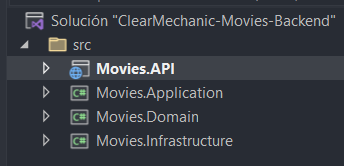
  - _CQRS Pattern_
    - Command Query Responsibility Segregation (CQRS) is implemented to separate the read and write operations, allowing for better performance and scalability.
      > 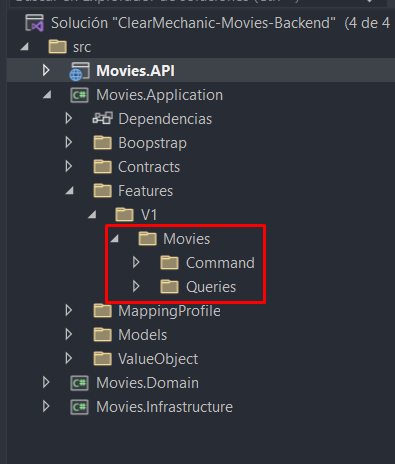 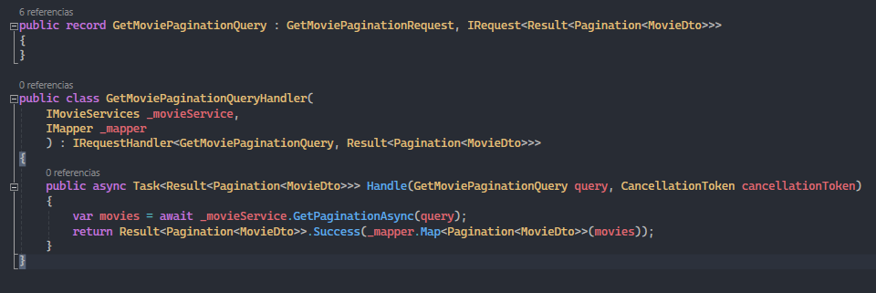 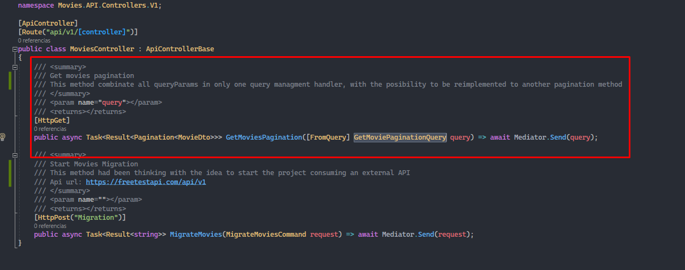
  - _Result Pattern_
    - In .NET 8, it's recommended to use the Result Pattern instead of exception handling, as it offers better performance.
      > 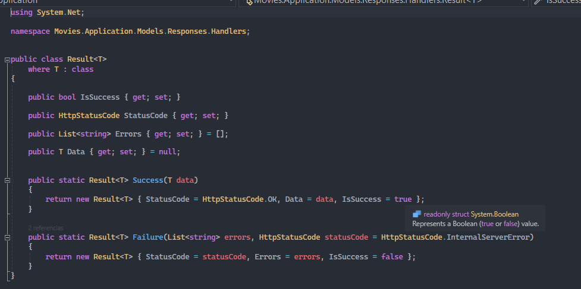
  - _Repository Pattern_
    - I would have liked to implement a Unit of Work or Generic Repository as well, but there wasn't a use case significant enough to justify it. Thus, the only implementation for the services was the Repository Pattern.
      > 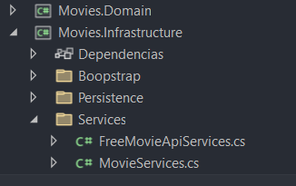 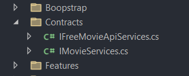 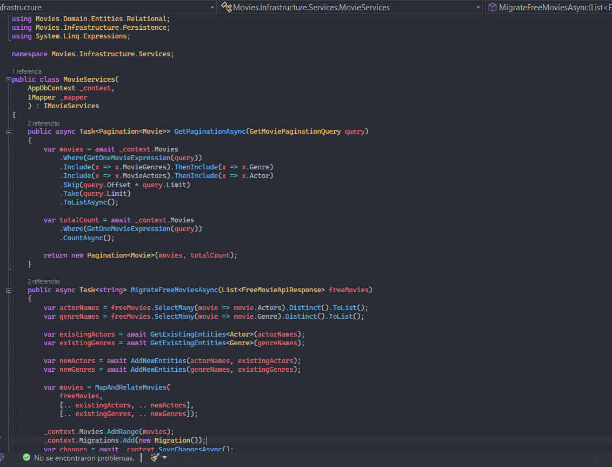

- **Configurations and implementations:**
  - _Middleware Exception_
    > 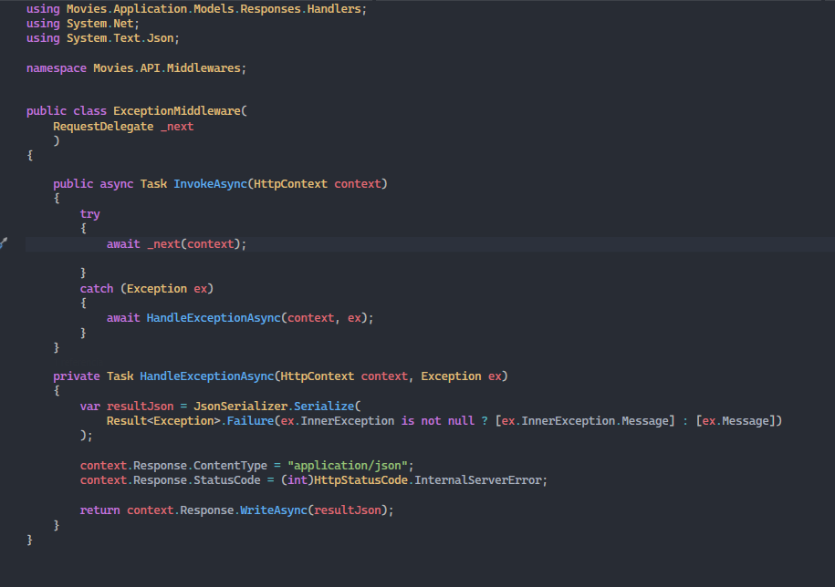
  - _Setting Manager_
    > 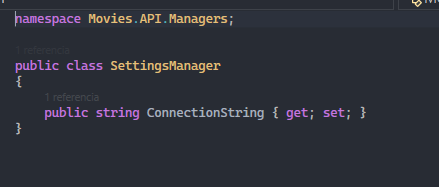
  - _Dependency Injections (Extensions)_
    > 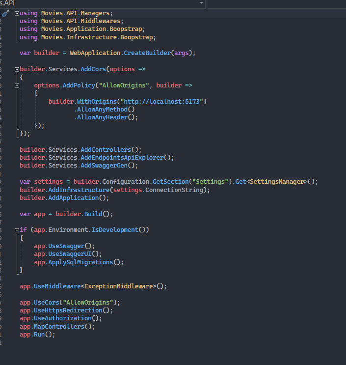
    - _Application Configuration_
      > 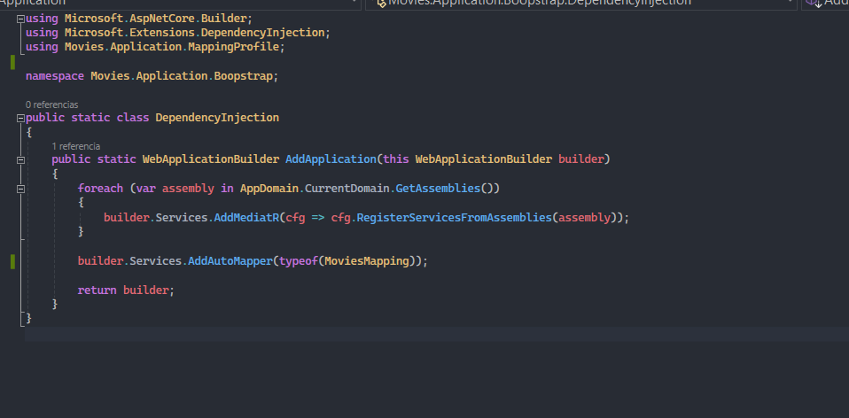
    - _Infrastructure Configuration_
      > 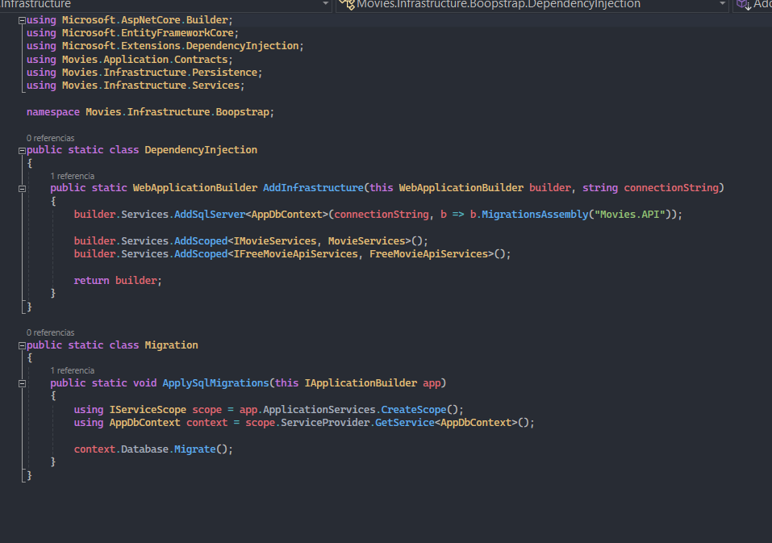

I used SQL Server for my DbContext, and it was implemented using the migration file created with the command in the NuGet console: **Add-Migration InitialMigration**.

> **IMPORTANT:**
>
> I created an additional method to demonstrate more structural and logical skills on the backend. The endpoint is for migration and creating new data by calling an external endpoint: `https://freetestapi.com/api/v1/movies`

## Frontend Solution

For the frontend, I built a basic application using VITE - React, also considering best practices during development. I could have added more features, but due to time constraints and the desire to focus on the main objectives, I kept the implementation simple, focusing on the core functionality.

- **Preview:**

  > 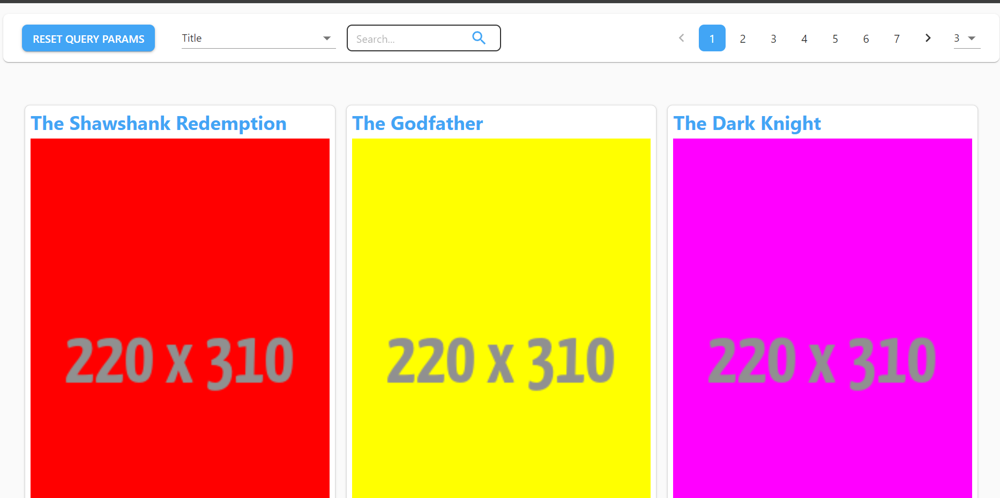

- **Search with input:**
  > **Title:** 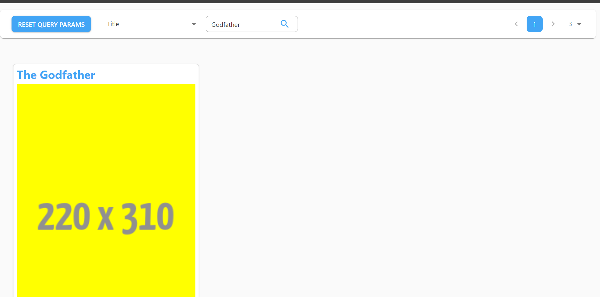 > **Actor:** 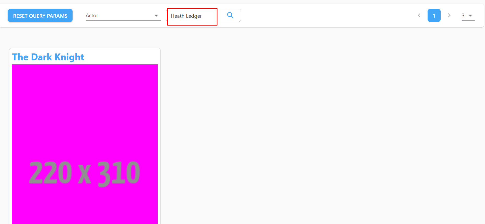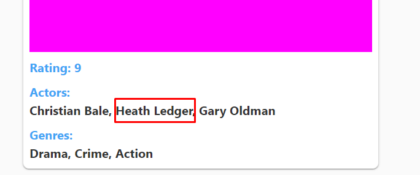 > **Genre:** 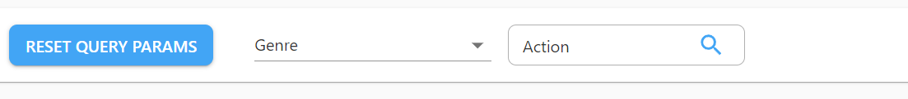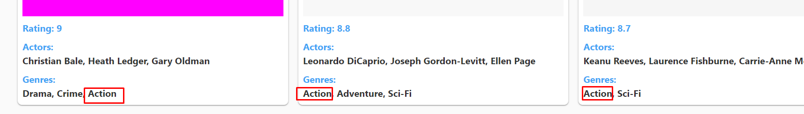
